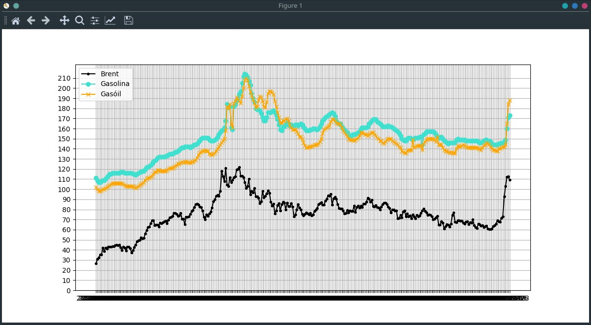

# Evolucion de los precios de los carburantes en España

Evolución de los precios de los carburantes España, frente a la evolución del precio del barril Brent, desde abril de 2020.

Los datos se obtuvieron de la plataforma investing.com en cuanto al precio del barril Brent, y de Europa Press en cuanto a los datos de Gasolina (referida a la Gasolina 95) y el Gasóil.

Los datos se normalizan, en el sentido de que en ambos _dataframes_ se establecen las columnas año y semana como referencia (no de los _dataframes_ ya las tenía, en el otro es necesario calcularla). Una vez hecho esto, se puede hacer un `df1.merge(df2, on=["Año", "Semana"])`, de manera que se obtiene el CSV en `normalized_data.csv`. El programa `plot_results.py` es el que muestra la parte más relevante de los datos, y muestra el gráfico.


## Datos más relevantes

Los datos más relevantes se obtienen filtrando por el precio del mayor Brent mayor que 110, de manera que se observa cómo los precios sí crecen con el precio del barril, pero no decrecen cuando este decrece. Además, los precios actuales no se corresponden con el precio del barril Brent, pues podemos ver como el barril Brent en la semana 9 de 2022 estuvo a 112$, y en cambio el precio del gasóil estaba por debajo de 1.5€/L. En cambio, en la semana 12 de 2026 el precio del barril Brent esta al mismo precio, y en cambio el precio del gasóil se sitúa en 1.84€/L., aún con IVA reducido.

### Año: 2022
Precio del barril Brent en dólares.
Precio de la Gasolina y el Gasóil en Euros/Litro.

|    Semana|   Brent |  Gasolina |  Gasóil|
|----------|---------|-----------|--------|
|        8 | 118.11  |    1.58   | 1.46   |
|        9 | 112.67  |    1.59   | 1.48   |
|       11 | 120.65  |    1.68   | 1.58   |
|       14 | 111.70  |    1.82   | 1.84   |
|       18 | 111.55  |    1.82   | 1.85   |
|       19 | 112.55  |    1.84   | 1.87   |
|       20 | 119.43  |    1.88   | 1.91   |
|       21 | 119.72  |    1.90   | 1.89   |
|       22 | 122.01  |    1.94   | 1.87   |
|       23 | 113.12  |    1.97   | 1.85   |
|       24 | 113.12  |    2.05   | 1.92   |
|       25 | 111.63  |    2.12   | 2.00   |
|       29 | 110.01  |    2.07   | 2.02   |


### Año 2026
Precio del barril Brent en dólares.
Precio de la Gasolina y el Gasóil en Euros/Litro.

|    Semana|   Brent |  Gasolina |  Gasóil|
|----------|---------|-----------|--------|
|       11 | 112.19  |    1.60   | 1.65   |
|       12 | 112.57  |    1.71   | 1.84   |


### Gráfica de evolución de los precios

Se aprecia como los precios en España siguen unos dientes de sierra más suaves, pues "tardan" mucho más en bajar que el precio del barril Brent.



## Ejecución

La ejecución puede realizarse directamente con `plot_results.py`, pero a continuación se muestra la forma de invocación por módulo, anteponiendo `python -m `, al ser más versátil. Las opciones son `-d`, que muestra los datos por la salida estándar, y `-g`. que muestra el gráfico que genera `pyploy`.

```bash
$ python -m plot_results.py -d
Year: 2022
...

$ python -m plot_results.py -g
```

## Origen de los datos
Referencias:
- Datos de los precios del barril brent (consultado el 10 de abril de 2026)
Plataforma de inversión
https://es.investing.com/commodities/brent-oil-historical-data

- Datos de los precios de los carburantes en España (consultado el 10 de abril de 2026
Plataforma de datos de Europa Press
https://www.epdata.es/evolucion-precio-gasolina-diesel-espana/ed822d1e-9d2c-487b-ad94-1b607dc42669

 
